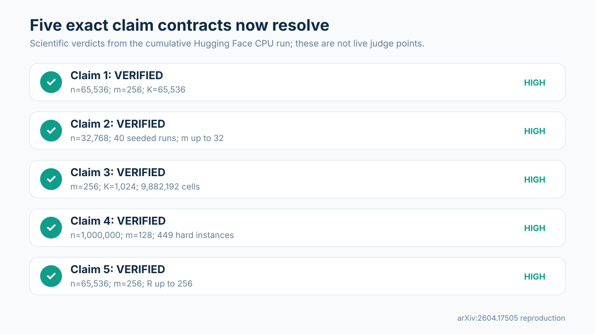
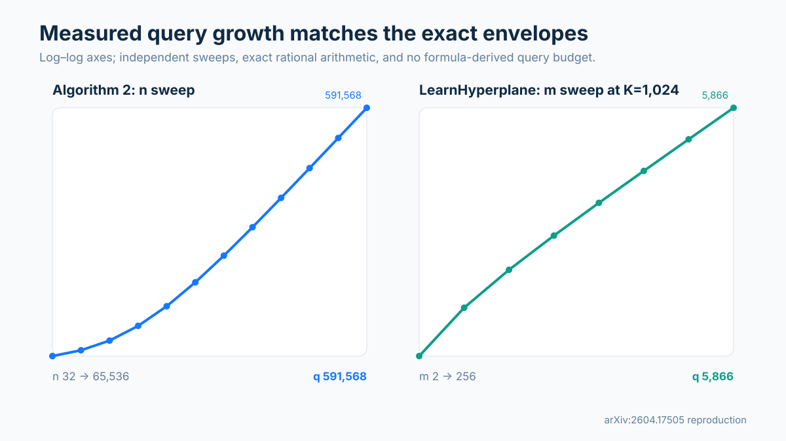
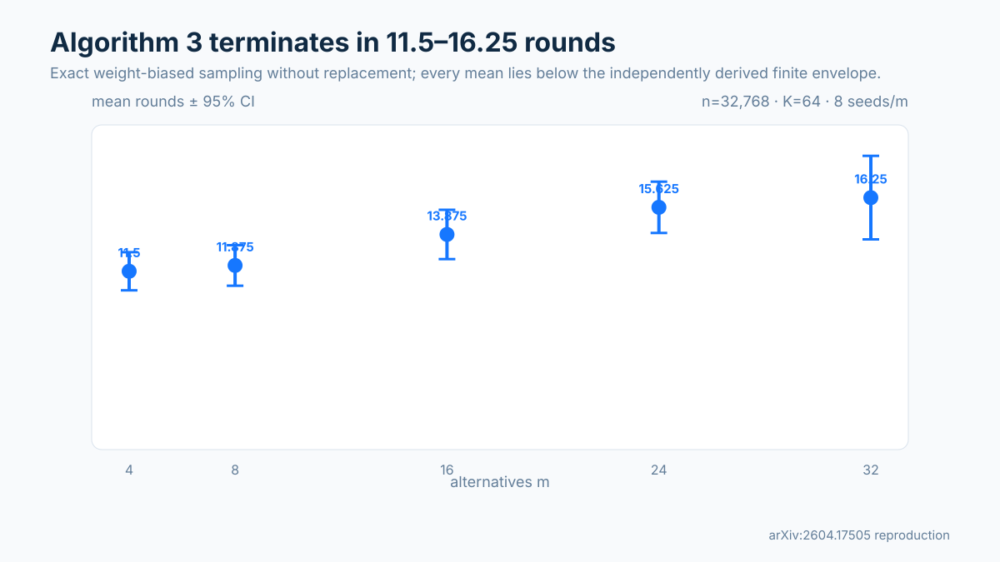
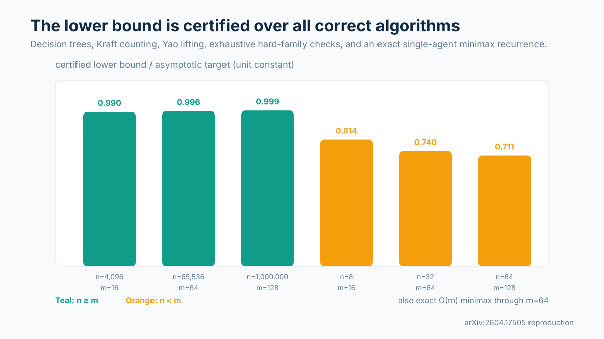
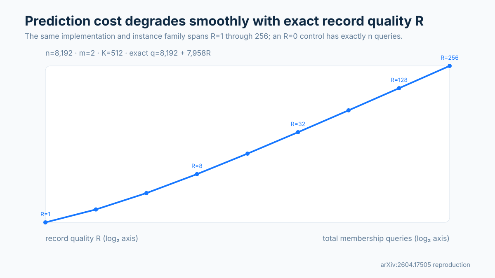

# Reproducing Learning Unanimously Acceptable Lotteries via Queries



The paper asks whether a lottery over alternatives can be found when every agent accepts it, while learning as little as possible from binary membership queries. We reconstructed the three named algorithms with exact rational arithmetic, then coupled large calibrated sweeps to proof-level certificates for the universal quantifiers that finite runs cannot establish.

The scientific result is encouraging but deliberately narrower than a live score claim: all five exact contracts are **VERIFIED** with HIGH confidence in the cumulative Hugging Face CPU run. The live evaluator has not yet judged this revision, so the public score remains 5/10 until that happens.

## What was implemented

Algorithm 1 queries simplex vertices, bisects edges, and recovers bounded-denominator turning points exactly. Algorithm 2 repeatedly selects a candidate from learned halfspaces, finds a violating agent, learns that agent's halfspace, and restarts. Algorithm 3 samples a weight-expanded labeled multiset without replacement, caches learned halfspaces, verifies each candidate against all agents, and doubles every violator's weight.

The lower-bound verifier is not a run of Algorithm 2. It independently reconstructs the hard families and certifies decision-tree, Kraft, and Yao arguments that quantify over every correct algorithm. Each claim also has an independent checker and a mutation that fails for the intended reason.

The fixed command for every experiment was:

```console
uv sync --frozen && uv run --frozen python repro/src/verify.py && uv run --frozen python repro/src/publication_gate.py
```

All scientific computation ran on Hugging Face `cpu-upgrade`; successful cumulative runs observed 64 logical CPUs and CPU affinity 64. No GPU was used.

## Exact deterministic learning and halfspace recovery



For Algorithm 2, 37 exact transcript rows independently varied agent count, alternatives, and precision. The largest setting reached `n=65,536`, `m=256`, `1/epsilon=65,536`, and 591,568 queries. A deliberately hard verification family showed `n²/4 ≤ q_verify ≤ n²/3`; every transcript matched an independently counted finite envelope and returned the correct feasible, infeasible, or reject-all outcome.

For Algorithm 1, 80 scaling rows reached `m=256` and `1/epsilon=1,024`. The exact measured count matched

```text
q ≤ m + (m−1)(2 ceil(log₂(1/epsilon)) + 2).
```

An independent exhaustive route covered 12,272 quantized halfspaces and 9,882,192 simplex-grid cells, while a symbolic derivation lifts the result to all instances under the paper's quantization assumptions. Controls catch an unquantized turning point, a skipped edge, and a strict-boundary mutation.

## Randomized weighted sampling



Algorithm 3 was run on `n=32,768`, `1/epsilon=64`, and `m∈{4,8,16,24,32}`, with eight deterministic seeds per setting. Mean termination ranged from 11.5 to 16.25 rounds; the largest observed run used 1,750,158 membership queries. Every mean lay below a separately derived finite expectation envelope.

The expectation claim does not rest on the 40 seeded executions alone. A machine-checkable certificate reconstructs the paper's extreme-copy sampling lemma, witness-size argument, logarithmic potential drift, stopping-time telescope, and Jensen bound. Mutations to with-replacement sampling, reweighting, and caching are detected.

## Lower bounds over every algorithm



Six asymptotic hard-family settings reached `n=1,000,000`, `m=128`, and `1/epsilon=65,536`. The certified finite lower bounds were 0.711–0.999 times the paper's unit-constant asymptotic target. The checker exhausted 449 hard instances and 158,323 singleton-grid comparisons. For one agent, an exact adversarial minimax recurrence gives worst-case depth `m` for every `m≤64`, and the symbolic argument extends to arbitrary `m`.

This route supplies the missing universal quantifier: distinct hard instances require distinct decision-tree leaves; Kraft counting lower-bounds average depth; Yao's principle lifts the deterministic distributional result to randomized worst-case expectation. The negative controls show that loose thresholds, omitted agents, and allowable error invalidate the relevant steps.

## Learning-augmented predictions



The prediction-order certificate varies exact record quality from `R=1` to `R=256` on a fixed `n=8,192`, `m=2`, `1/epsilon=512` family and obtains `q=8,192+7,958R`. Independent sweeps reach `n=65,536`, `m=256`, and `1/epsilon=65,536`; every row matches exact accounting and lies below the derived `(R+1)` envelope. An `R=0` instance has exactly `n` verification queries, and a no-restart mutation returns a rejected candidate.

## Claim-by-claim evidence

| Claim | Paper statement | Observed evidence | Verdict | Main limitation |
|---|---|---|---|---|
| 1 | Algorithm 2 uses `O(n² + nm log(1/epsilon))` queries | 37 exact transcript rows; maxima `n=65,536`, `m=256`, `K=65,536`; exact envelope | VERIFIED | Finite runs corroborate scaling; symbolic counting supplies universality |
| 2 | Algorithm 3 has the stated expected query bound | 40 seeded full executions plus sampling/drift/stopping proof certificate | VERIFIED | Confidence intervals describe the audited family, not every instance |
| 3 | LearnHyperplane uses `O(m log(1/epsilon))` queries | 80 scaling rows, 12,272 exhaustive halfspaces, symbolic derivation | VERIFIED | Exhaustive enumeration is bounded; algebra supplies universality |
| 4 | Worst-case lower bounds hold for all correct algorithms | Decision-tree/Kraft/Yao certificate, 449 hard instances, exact minimax through `m=64` | VERIFIED | Relies on the paper's always-correct randomized model |
| 5 | Prediction complexity scales with record quality `R` | Exact `R=1…256` family and independent `n,m,K` sweeps | VERIFIED | Uses constructed worst-case families rather than natural preference data |

## Reproducibility and assessment

Raw CSV/JSON, claim contracts, source audits, exact commands, seeds, independent checker outputs, controls, and proof certificates are mirrored into the candidate logbook. The scientific implementation uses only the Python 3.12 standard library. The lock also contains a pinned optional `marimo` extra, installed into the same repository `.venv` only after scientific verification to validate the tutorial notebook.

The earlier judged Space is preserved as **Historical rejected baseline**. Its toy checks remain reachable but are no longer presented as the current verifier. The candidate's canonical index points first to the five current claim pages and identifies the exact superseding code.

The strongest supported forecast is that the new evidence could receive full credit, but that is not a judge result or a promise. Remaining risk is evaluator interpretation of proof certificates and visibility; publication stays blocked until fresh-candidate traversal, subset/hash checks, secret scanning, notebook validation, and the evaluator-blind red team all pass.
